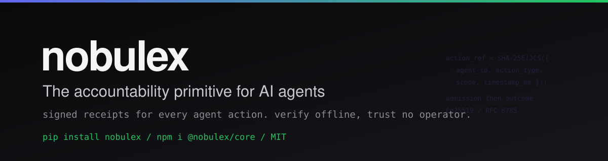

<div align="center">



<br/>

[](https://github.com/arian-gogani/nobulex/actions/workflows/ci.yml)
[](https://www.bestpractices.dev/projects/10338)
[](https://pypi.org/project/nobulex/)
[](https://www.npmjs.com/package/@nobulex/core)
[](https://opensource.org/licenses/MIT)
[](./drafts/draft-gogani-nobulex-proof-of-behavior-00.txt)

<br/><br/>

**Every person has a credit score. Every business has one.**
**AI agents have nothing.**

Nobulex is the credit and trust protocol for autonomous AI agents.<br/>
Agents earn Trust Capital through verified behavior. Higher trust, more access.<br/>
Autonomy earned, not granted.

[Website](https://nobulex.com) · [Try it live](https://nobulex.com/demo) · [Quickstart](./GETTING-STARTED.md) · [Spec](./drafts/draft-gogani-nobulex-proof-of-behavior-00.txt) · [PyPI](https://pypi.org/project/nobulex/) · [npm](https://www.npmjs.com/package/@nobulex/core)

</div>

---

> ### Break the AI. Win $7,400.
> Five AI agents, each with rules they must not break. Make them violate their own rules. Beat Level 5 to claim the bounty. **29 attempts, 0 winners so far.**
>
> **[Enter the Arena →](https://nobulex.com/arena)**

---

## Install

```bash
pip install nobulex
```

```bash
npm install @nobulex/core
```

```python
from nobulex.agent import Agent
agent = Agent("my-agent")
receipt = agent.act("send_email", scope="user@example.com")
assert receipt.verify()  # tamper-proof
```

---

## How it works

Every agent action produces a cryptographic receipt -- Ed25519 signed before and after execution, hash-chained for tamper evidence. A third party can verify the full history without trusting the agent or the operator.

Here is the whole idea in one run (`python -m nobulex demo`):

```
generated 3 receipts
  allow: 141ca2947a7e819b8bdebbf8... verified=True
  allow: f3377758ac94d812535cbb99... verified=True
  deny:  85b2dfd6b87f2678795726e4... verified=True
trust score: 23.26

tamper test:
  modified receipt verified=False   (tamper detected)
```

Change one byte of a receipt and verification fails. That is the whole guarantee.

**Performance:** ~13,683 signed receipts/sec at p50 (Python SDK, single core). Full signed-and-chained receipt takes ~73 μs end-to-end. See [BENCHMARKS.md](./docs/BENCHMARKS.md) for the full breakdown; reproduce with `python3 scripts/benchmark.py`.

Receipts accumulate into **Trust Capital** -- a credit score for the agent.

| Tier | Trust Capital | Access Level |
|------|--------------|--------------|
| Restricted | 0 -- 30 | Read-only, sandboxed execution |
| Standard | 30 -- 60 | Financial ops up to $500, API access |
| Trusted | 60 -- 85 | Cross-org operations, regulated markets |
| Sovereign | 85+ | Full autonomy, self-directed |

Agents that create more value earn more access. Agents that deviate get cut off automatically. Not as punishment -- as math.

---

## Quick start

### Python (recommended for AI agents)

```bash
# Or install from source
pip install git+https://github.com/arian-gogani/nobulex.git#subdirectory=packages/python
```

```bash
# Or try the CLI demo instantly
git clone https://github.com/arian-gogani/nobulex.git
cd nobulex/packages/python
pip install -e .
python -m nobulex demo
```

```python
from nobulex import Agent

agent = Agent("my-agent")
receipt = agent.act("send_email", scope="user@example.com")
assert receipt.verify()       # Cryptographic proof
print(agent.trust_score)      # Trust Capital: 13.86
```

#### LangChain integration

```python
from nobulex.integrations.langchain import NobulexAuditHandler

handler = NobulexAuditHandler(agent_id="my-agent")
agent.invoke({"input": "..."}, config={"callbacks": [handler]})
handler.export("audit.json")  # signed, hash-chained audit trail
```

#### CrewAI integration

```python
from nobulex.integrations.crewai import NobulexCrewAudit

audit = NobulexCrewAudit(agent_id="my-crew")
audit.record_task("credit_check", "loan-app-4821")
audit.export("audit.json")
```

#### Google ADK integration

```python
from nobulex.integrations.google_adk import NobulexADKCallback

cb = NobulexADKCallback(agent_id="my-agent")

@cb.wrap_tool("web_search")
def search(query):
    return do_search(query)

cb.export("audit.json")
```

#### PydanticAI integration

```python
from nobulex.integrations.pydantic_ai import NobulexPydanticAIAudit

audit = NobulexPydanticAIAudit(agent_id="typed-agent")
audit.record_tool("get_weather", {"city": "Berlin"}, {"temp": 22})
audit.export("audit.json")
```

#### Haystack integration

```python
from nobulex.integrations.haystack import NobulexHaystackAudit

audit = NobulexHaystackAudit(agent_id="my-pipeline")
audit.record_component("Retriever", {"query": "test"}, {"docs": 5})
audit.export("audit.json")
```

#### LlamaIndex integration

```python
from nobulex.integrations.llama_index import NobulexLlamaIndexAudit

audit = NobulexLlamaIndexAudit(agent_id="llama-agent")
audit.record_tool("web_search", {"query": "test"}, {"results": 5})
audit.export("audit.json")
```

#### Verify any exported trail (no operator trust)

```python
from nobulex.chain import verify_audit_trail
report = verify_audit_trail("audit.json", authorized_keys=AGENT_PUBLIC_KEY)
assert report["chain_intact"] and report["authenticated"]
```

### JavaScript / TypeScript

```bash
npm install @nobulex/core
npx tsx examples/trust-capital-demo.ts
```

```
Agent starts at RESTRICTED tier (Trust Capital: 0)

Action 1: read_data       — ALLOWED   (Trust Capital: 12)
Action 2: read_data       — ALLOWED   (Trust Capital: 24)
Action 3: process_payment — BLOCKED   (insufficient trust)
Action 4: read_data       — ALLOWED   (Trust Capital: 36)
Action 5: read_data       — ALLOWED   (Trust Capital: 48)

Agent promoted to STANDARD tier
Action 6: process_payment — ALLOWED   (Trust Capital: 65)

Agent promoted to TRUSTED tier (Trust Capital: 89)
Action 8: approve_contract — ALLOWED
```

---

## The protocol

```
DECLARE ──► ENFORCE ──► PROVE ──► ACCUMULATE

Covenant      Pre-execution     Receipt chain     Trust Capital
defines       receipt blocks    verified by       earned over
the rules     violations        third parties     time
              before they
              happen                              ──► more access
                                                      ──► more receipts
                                                           ──► higher trust
```

The flywheel: more Trust Capital leads to more valuable work, which produces more receipts, which builds higher Trust Capital. Accountability becomes the most profitable strategy.

---

## Code

```typescript
import { createDID, parseSource, EnforcementMiddleware, verify } from '@nobulex/core';

const agent = await createDID();
const spec = parseSource(`
  covenant SafeTrader {
    permit read;
    permit transfer (amount <= 500);
    forbid transfer (amount > 500);
    forbid delete;
  }
`);

const mw = new EnforcementMiddleware({ agentDid: agent.did, spec });

await mw.execute(
  { action: 'transfer', params: { amount: 300 } },  // allowed
  async () => ({ success: true }),
);

await mw.execute(
  { action: 'transfer', params: { amount: 600 } },  // BLOCKED before execution
  async () => ({ success: true }),                    // never runs
);

const result = verify(spec, mw.getLog());
console.log(result.compliant);   // true
```

---

## Traction

Independent, verifiable signals (each links to evidence):

| | What | Evidence |
|---|---|---|
| | **OWASP CheatSheetSeries** | Sections 8-11 (JCS canonicalization, cross-agent accountability, sanctions-list freshness, regulatory mapping) merged into master by Jim Manico, Jun 2026 ([PR #2210](https://github.com/OWASP/CheatSheetSeries/pull/2210)) |
| | **vaara v0.50** | Independent third-party adoption — Henri Sirkkavaara shipped EU AI Act Article 12 audit trails citing the nobulex signed-receipt design ([GitHub](https://github.com/vaaraio/vaara)) |
| | **Dify Marketplace** | Plugin PR open on 60,000+ star platform ([PR #2500](https://github.com/langgenius/dify-plugins/pull/2500)). LangGenius Community Operations confirmed architecture is sound and Trust Capital is genuinely differentiated. |
| | **Microsoft AI Agents for Beginners** | PR open to add nobulex as the Python production receipt library in Lesson 18 — Securing AI Agents with Cryptographic Receipts ([PR #571](https://github.com/microsoft/ai-agents-for-beginners/pull/571)) |
| | **AgentAudit AI** | Five-point integration partnership active. Signed specimen receipt verifies end-to-end in 10 lines of Python ([fixture](./fixtures/agentaudit-specimen-v1.json)) |
| | **Microsoft AGT** | Listed in [ADOPTERS](https://github.com/microsoft/agent-governance-toolkit/pull/1703) (PR merged by Microsoft maintainers) |
| | **builderz-labs / mission-control** | Cross-session Trust Capital RFC accepted as open issue; TypeScript reference implementation delivered |

EU AI Act Article 12 enforcement: August 2, 2026.

---

## Why now

AI agents are being deployed into production with no accountability infrastructure.

- **86%** of AI agents deployed without security approval (CSA, 2026)
- **UUMit** launched the first A2A marketplace with zero identity verification
- **$138B+** committed to physical AI with zero accountability layer
- Top models score **10-15%** on real problems (LemmaBench) with zero traceability on failure

The agents are deployed. The money is flowing. The accountability infrastructure doesn't exist yet. We're building it.

---

## Standards

| Standard | Status |
|---|---|
| Proof-of-Behavior spec | [`draft-gogani-nobulex-proof-of-behavior-00`](./drafts/draft-gogani-nobulex-proof-of-behavior-00.txt) |
| Microsoft AGT | Listed in [ADOPTERS](https://github.com/microsoft/agent-governance-toolkit/pull/1703) (PR merged) |
| CTEF v0.3.2 | 14/14 byte-match conformance |
| A2A Protocol | Receipt row proposed; URN scheme `urn:nobulex:receipt:<id>` |
| NIST RFI | Formal comments submitted |

---

## Development

```bash
git clone https://github.com/arian-gogani/nobulex.git
cd nobulex && npm install
npx vitest run              # tests
npx tsx examples/demo.ts    # end-to-end
npx tsx benchmarks/bench.ts # benchmarks
```

---

<div align="center">

[Website](https://nobulex.com) · [Try it](https://nobulex.com/demo) · [npm](https://www.npmjs.com/package/@nobulex/core) · [Spec](./drafts/draft-gogani-nobulex-proof-of-behavior-00.txt) · [X @nobulexlabs](https://x.com/nobulexlabs)

**[Star this repo](https://github.com/arian-gogani/nobulex/stargazers)** to follow the project

MIT License

</div>
