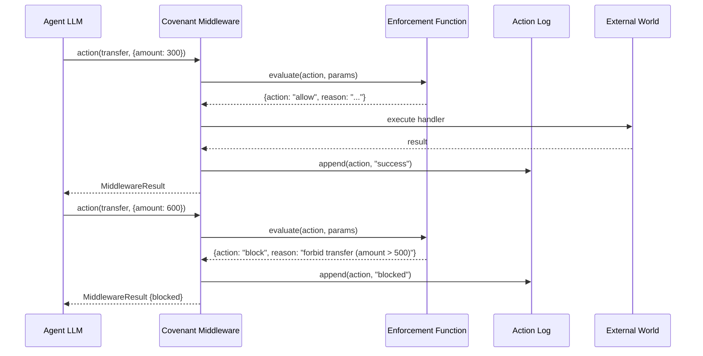

# Nobulex: The Proof-of-Behavior Protocol for Autonomous AI Agents

**Version 1.0 -- February 2026**

> **Implementation Status:** This paper describes the complete protocol design. The core primitives (identity, covenant, action log, middleware, verification) are fully implemented and tested (6,138 tests). TEE integration is currently in simulation mode. On-chain contracts are implemented but not yet deployed to any network. See the README for current implementation status.


## Abstract

As autonomous AI agents acquire the capacity to execute financial transactions, negotiate contracts, and manage critical infrastructure on behalf of human principals, the absence of a standardized mechanism for behavioral accountability constitutes a systemic risk to the emerging agent economy. This paper presents Nobulex, an open cryptographic protocol that enables autonomous AI agents to make verifiable behavioral commitments through a novel construct termed a *covenant*. The protocol introduces six composable primitives -- identity, covenant, attestation, action log, verification, and enforcement -- that together form a complete proof-of-behavior stack operating independently of any particular model architecture or deployment environment. Nobulex provides two tiers of behavioral guarantee: *impossible violations*, achieved through covenant middleware executing within Trusted Execution Environments (TEEs), and *costly violations*, achieved through stake-based economic enforcement with on-chain slashing. The verification function at the core of the protocol is deterministic, decidable, and efficient: given a covenant specification and an action log, it produces an identical compliance verdict on every execution. This paper presents the formal specification of each primitive, the security model governing both tiers of guarantee, the economic design of the staking and slashing mechanism, and the composability framework that enables trust topologies to emerge across multi-agent systems without central coordination.

## 1. Introduction and Problem Statement

The rapid proliferation of autonomous AI agents represents a qualitative shift in the relationship between artificial intelligence systems and the economic infrastructure of human society. Where previous generations of AI operated as passive tools invoked by human operators -- responding to queries, classifying inputs, generating content -- the current generation of agents operates with increasing economic autonomy. These agents book flights, manage investment portfolios, execute trades across decentralized exchanges, negotiate service-level agreements, procure goods on behalf of organizations, and interact with other agents in complex supply chains. Industry analysts project that the total economic activity mediated by AI agents will exceed four trillion US dollars by 2028 [1][2], a figure that implies agents will soon handle a significant fraction of all digital commerce.

This economic autonomy creates an urgent infrastructure gap. The existing protocol landscape addresses several dimensions of agent interoperability but leaves behavioral accountability entirely unresolved. The Model Context Protocol (MCP) [3] standardizes how agents interact with external tools and data sources, defining a structured interface for tool invocation and response handling. The Agent-to-Agent (A2A) protocol [4] standardizes inter-agent messaging, enabling agents built on different platforms to exchange structured communications. Emerging payment protocols handle the financial settlement layer. However, no existing protocol addresses the fundamental question: *when Agent A wishes to transact with Agent B, how can either party verify that the other will behave according to its stated commitments?*

Current approaches to AI behavioral assurance are inadequate for this setting. Reinforcement Learning from Human Feedback (RLHF) and related alignment techniques operate on the probabilistic weights of a model and produce statistical tendencies rather than deterministic guarantees [5]. An RLHF-aligned model is *likely* to refuse harmful requests, but this likelihood cannot be formally verified, quantified with precision, or communicated as a binding commitment to a counterparty. API rate limits and content filters provide blunt guardrails but operate at the infrastructure level rather than the behavioral level: they constrain throughput and surface-level content patterns, not the semantic properties of agent actions. Terms of service are unilateral legal documents with no cryptographic enforcement mechanism; their violation is detectable only through after-the-fact litigation, a process wholly incompatible with the millisecond timescales of agent-mediated transactions.

The trust gap is therefore structural. When a portfolio management agent operated by Firm A encounters a trading agent operated by Firm B, neither agent possesses any mechanism to verify the behavioral commitments of the other. Firm A's agent cannot confirm that Firm B's agent will honor position limits, respect data confidentiality constraints, or comply with regulatory requirements. This absence of verifiable trust is precisely analogous to the state of internet commerce before the widespread deployment of HTTPS and the public key infrastructure: transactions were technically possible but practically unsafe, and the absence of trust infrastructure suppressed the volume and sophistication of economic activity by orders of magnitude.

Nobulex addresses this gap by providing the behavioral accountability layer -- a protocol that is to agent trust what HTTPS is to transport security and what Ethereum is to contract execution.

## 2. Core Insight

The central insight of the Nobulex protocol is that behavioral accountability does not require understanding or verifying the internal state of a model. Model weights are high-dimensional, opaque, and computationally intractable to audit. Any attempt to guarantee behavior by inspecting model internals confronts fundamental barriers: the space of possible inputs is unbounded, the mapping from weights to behavior is nonlinear and poorly understood, and the computational cost of formal verification over neural network parameters grows super-exponentially with model size.

Nobulex sidesteps this intractability entirely. Rather than verifying the *model*, the protocol verifies *actions against stated commitments*. An agent publishes a covenant -- a formal specification of permitted, forbidden, and required behaviors. Every action the agent subsequently takes is recorded in a hash-chained log. The verification function then evaluates whether the recorded actions comply with the covenant specification:

```
verify(covenant, actionLog) -> {compliant: boolean, violations: Violation[]}
```

This function is always *decidable*: for any well-formed covenant and action log, it terminates in finite time. It is always *deterministic*: given the same inputs, it produces the same output on every execution, regardless of the machine, time, or context in which it runs. It is always *efficient*: its computational complexity is linear in the number of action log entries and the number of covenant rules, making it practical for real-time and post-hoc verification at arbitrary scale.

The analogy is instructive: financial regulators do not audit a bank employee's thoughts, beliefs, or intentions. They audit the employee's *transactions* against *policy*. If a policy states that transfers exceeding a threshold require secondary authorization, compliance is verified by examining the transaction ledger and confirming that every above-threshold transfer has a corresponding authorization record. This is precisely the verification paradigm that Nobulex implements for autonomous agents.

## 3. The Six Primitives

The Nobulex protocol is composed of six orthogonal primitives, each addressing a distinct aspect of the accountability stack. These primitives are designed to be independently useful and collectively sufficient: any subset can be deployed in isolation for partial benefit, but their composition yields the full accountability guarantee.

### 3.1 Identity (DID)

Every agent in the Nobulex protocol is identified by a W3C Decentralized Identifier (DID) [6] using the `did:nobulex:` method. Agent identity is anchored to an Ed25519 key pair, providing both authentication (proving the agent is who it claims to be) and non-repudiation (preventing the agent from denying actions it has signed).

The DID Document associated with each agent conforms to the W3C DID Core specification and contains the following fields: a set of verification methods (each specifying an `Ed25519VerificationKey2020` with the agent's public key in hexadecimal encoding), authentication references (indicating which verification methods may be used for authentication challenges), and assertion method references (indicating which verification methods may be used for issuing signed assertions such as covenant attestations). The document also records creation and update timestamps in ISO 8601 format.

Agent identity in Nobulex is not static. The `@nobulex/identity` package implements a lineage tracking system in which every identity change -- model updates, capability expansions or reductions, operator transfers -- is recorded as a signed lineage entry with a parent hash linking to the previous state. This produces a tamper-evident chain of identity evolution, enabling verifiers to trace the full provenance of an agent's identity and to apply reputation carry-forward rates that reflect the magnitude of identity changes. A minor update preserves 95% of accumulated reputation, a model version change within the same family preserves 80%, and a model family change preserves only 20%.

### 3.2 Covenant (Behavioral Specification)

The covenant is the central primitive of the Nobulex protocol. A covenant is a formal specification of an agent's behavioral commitments, expressed in a Cedar-inspired domain-specific language (DSL) [7] with permit, forbid, and require semantics.

The Covenant DSL supports three statement types. *Permit* statements declare that an action is allowed, optionally subject to conditions. *Forbid* statements declare that an action is prohibited, optionally subject to conditions. *Require* statements declare that a field in the action context must satisfy a comparison against a threshold value. The following example illustrates the syntax:

```
covenant SafeTrader {
  permit read;
  permit transfer (amount <= 500);
  forbid transfer (amount > 500);
  require counterparty.compliance_score >= 0.8;
}
```

The evaluation semantics are precisely defined. *Forbid-wins*: if any forbid statement matches an action (i.e., the action name matches and all conditions evaluate to true), the action is blocked regardless of whether a permit statement also matches. *Default-deny*: if no permit statement matches an action, the action is blocked. Requirements are checked for all permitted actions; a failed requirement blocks the action even if a permit rule matches. Conditions support six comparison operators (`>`, `<`, `>=`, `<=`, `==`, `!=`) over numeric, string, and boolean fields, with dotted-path resolution for nested parameters.

The `@nobulex/covenant-lang` package implements a complete pipeline from source text to enforcement function: the lexer (`tokenize`) produces a token stream; the parser (`parse`) produces a `CovenantSpec` abstract syntax tree containing `CovenantStatement` and `CovenantRequirement` nodes; and the compiler (`compile`) produces a pure `EnforcementFn` that evaluates an `ActionContext` and returns a deterministic `EnforcementDecision`.

### 3.3 Attestation (W3C Verifiable Credential)

A signed covenant is wrapped in a W3C Verifiable Credential [8] to produce a `CovenantAttestation` -- a self-contained, cryptographically verifiable document that any third party can validate without trusting the issuer. The attestation structure conforms to the W3C VC Data Model and contains:

- **Context**: JSON-LD context URIs defining the credential vocabulary (`https://www.w3.org/2018/credentials/v1`).
- **Type**: An array including `VerifiableCredential` and `CovenantAttestation`.
- **Issuer**: The DID of the entity issuing the attestation.
- **Issuance Date**: ISO 8601 timestamp of credential creation.
- **Expiration Date**: Optional ISO 8601 timestamp after which the credential is no longer valid.
- **Credential Subject**: Contains the subject DID and the full `SignedCovenant` object.
- **Proof**: An `Ed25519Signature2020` proof containing the creation timestamp, a reference to the verification method, the proof purpose (`assertionMethod`), and the hexadecimal-encoded signature value.

The attestation is the unit of trust exchange between agents. When Agent A wishes to transact with Agent B, Agent B presents its covenant attestation. Agent A verifies the Ed25519 signature against the issuer's public key, confirms the credential has not expired, and inspects the covenant specification to determine whether Agent B's behavioral commitments are compatible with Agent A's requirements.

### 3.4 Action Log (Hash-Chained Ledger)

Every action performed by a Nobulex-instrumented agent is recorded in a hash-chained action log. Each entry in the log contains the following fields: `index` (zero-based sequential position), `timestamp` (ISO 8601), `agentDid` (the DID of the acting agent), `action` (the action name), `resource` (the resource acted upon), `params` (arbitrary key-value parameters), `outcome` (one of `success`, `failure`, or `blocked`), `previousHash` (the SHA-256 hash of the preceding entry, or null for the first entry), and `hash` (the SHA-256 hash of all other fields in canonical JSON form).

The hash-chaining mechanism ensures tamper evidence: modifying any field of any entry invalidates that entry's hash, which in turn invalidates the `previousHash` field of the subsequent entry, cascading through the remainder of the chain. The integrity verification function (`verifyIntegrity`) checks four invariants: (1) each entry's hash matches its recomputed content hash, (2) each entry's `previousHash` matches the prior entry's hash, (3) indices are sequential starting from zero, and (4) timestamps are non-decreasing.

The `@nobulex/action-log` package also implements a Merkle tree construction over action log entries, enabling efficient proofs of inclusion. The `buildMerkleTree` function constructs a binary tree from the leaf hashes (the `hash` field of each entry), combining pairs via SHA-256 concatenation at each level. The `generateMerkleProof` function produces a proof for any specific entry, consisting of sibling hashes at each tree level. The `verifyMerkleProof` function independently verifies such a proof by recomputing the path to the root. Merkle proofs enable a verifier to confirm that a specific violating action exists in the log without requiring access to the complete log.

### 3.5 Verification (Deterministic Function)

The verification function is the core of the Nobulex accountability guarantee. Implemented in the `@nobulex/verification` package, it takes a `CovenantSpec` and an `ActionLog` and produces a `VerificationResult` through the following deterministic procedure:

1. **Hash-chain integrity verification**: Verify that the action log has not been tampered with by checking all hash linkages, index sequencing, and timestamp ordering.
2. **Merkle tree construction**: Build a Merkle tree over the log entries to enable efficient proofs of specific violations.
3. **Covenant compilation**: Compile the covenant specification into an enforcement function via the `@nobulex/covenant-lang` compiler.
4. **Entry-by-entry evaluation**: Evaluate each action log entry (excluding those with outcome `blocked`, which were already enforced by middleware) against the compiled enforcement function. Any entry for which the enforcement function returns `block` constitutes a violation.

The `VerificationResult` contains: a boolean `compliant` field (true if and only if no violations were found), the covenant identifier, the agent DID, the total number of actions checked, an array of `Violation` objects (each containing the entry index, action, resource, the matched rule, a human-readable reason, and the timestamp), and the Merkle root hash. The `proveViolation` function generates a Merkle proof for any specific violation, and the `verifyBatch` function verifies multiple covenants against the same action log in a single pass.

### 3.6 Enforcement (Staking and Slashing)

The enforcement primitive provides economic consequences for covenant violations through three Solidity smart contracts deployed on EVM-compatible blockchains:

**CovenantRegistry**: Stores covenant hashes on-chain with associated agent DID metadata. The `registerCovenant` function accepts a `bytes32` covenant hash (the SHA-256 hash of the serialized covenant specification), the agent DID, and an optional metadata URI. Each covenant receives a unique sequential identifier. Covenants can be deactivated but not deleted, preserving the historical record.

**StakeManager**: Manages ETH staking for covenants. Agents stake ETH on specific covenant identifiers, with a configurable minimum stake requirement. Stakes can be locked by the slashing judge prior to slashing, preventing front-running withdrawals. The `slash` function, callable only by the authorized slashing judge, deducts a specified amount from the agent's stake.

**SlashingJudge**: Processes violation reports and computes slash amounts with escalation. The slash percentage follows the escalation formula:

```
slashPercent = baseSlashPercent + escalationPercent * incidentCount
```

The result is capped at `maxSlashPercent` to prevent complete stake destruction from a single reporting event. A configurable cooldown period between slashing events for the same agent-covenant pair prevents griefing attacks. The `submitViolation` function accepts the covenant identifier, violator address, evidence hash (typically the Merkle root of the action log), and violation count, then locks the stake, computes the escalated slash amount, executes the slash, and updates the incident record.

## 4. Two-Tier Guarantee Model

The Nobulex protocol provides two complementary tiers of behavioral guarantee, distinguished by the nature of the assurance they offer.

### 4.1 Tier 1: Impossible Violations (Middleware in TEE)

The strongest guarantee tier renders covenant violations physically impossible by executing the enforcement middleware inside a Trusted Execution Environment. The `EnforcementMiddleware` class from the `@nobulex/middleware` package intercepts every agent action *before* execution. The middleware compiles the covenant specification into an enforcement function, evaluates each incoming action against the function, and either permits execution (invoking the handler and recording a `success` or `failure` outcome) or blocks execution (recording a `blocked` outcome without invoking the handler).

When this middleware runs inside a TEE -- Intel SGX enclaves, Intel TDX virtual machines, or AMD SEV-SNP virtual machines -- the hardware provides cryptographic assurance that the middleware code has not been modified or bypassed. The architecture is as follows:

```
+---------------------------------------------------+
|                   TEE Enclave                      |
|                                                    |
|  Agent LLM --> Covenant Middleware --> External     |
|                      |                  World      |
|                      v                             |
|                Action Log                          |
|           (hash-chained, sealed)                   |
+---------------------------------------------------+
```

The TEE attestation mechanism, implemented in the `@nobulex/tee` package, binds the agent's DID and public key to the enclave measurement through the report data field:

```
reportData = SHA-256(agentDid + publicKey + nonce)
```

Remote verifiers can request an attestation quote from the TEE hardware, verify the quote against known-good enclave measurements (MRENCLAVE for SGX, launch digest for SEV-SNP), and confirm that the report data matches the expected binding. The `TEERegistry` class maintains mappings between DIDs and their TEE identity bindings, enabling any party to check whether an agent's covenant middleware is operating within a verified TEE.

The attestation verification procedure, implemented in the `verifyAttestation` function, checks nine properties: debug mode prohibition, minimum security version, measurement whitelist, signer whitelist, minimum TCB level, TCB revocation status, endorsement expiry, quote freshness, and certificate chain presence. Three security levels are supported: `hardware` (production TEE with full hardware protection), `software` (software-emulated TEE for testing), and `simulated` (development-only simulation).

The result of Tier 1 deployment is a physical guarantee: forbidden actions *cannot* execute because the only execution path passes through the enforcement middleware, and the middleware's integrity is attested by the TEE hardware. The guarantee is not economic (the agent *chooses* to comply because violation is costly) but physical (the agent *cannot* violate because the execution environment prevents it).

### 4.2 Tier 2: Costly Violations (Stake-Enforced)

When TEE deployment is not available or not practical, the protocol falls back to economic enforcement. In Tier 2, the agent stakes ETH on its covenant through the `StakeManager` contract. Post-hoc verification detects violations through the deterministic `verify` function, and the `SlashingJudge` contract slashes the agent's stake with escalation:

```
slashPercent = baseSlashPercent + escalationPercent * incidentCount
if (slashPercent > maxSlashPercent) slashPercent = maxSlashPercent
slashAmount = (stakedAmount * slashPercent) / 100
```

The escalation mechanism ensures that repeat offenders face progressively greater consequences, while the cooldown period prevents adversaries from draining an agent's stake through rapid-fire false or trivial reports. The rational agent theorem applies: if the expected cost of violation (probability of detection multiplied by the slash amount) exceeds the expected benefit of the violation, a rational agent will choose compliance. By calibrating stake amounts and slash percentages to the economic value of the transactions the covenant governs, the protocol can make violation economically irrational for any sufficiently capitalized agent.

### 4.3 Guarantee Composition

A single agent may operate under both tiers simultaneously. Tier 1 (TEE-enforced) applies to critical, high-stakes constraints -- for example, an absolute prohibition on transfers exceeding a threshold, or a requirement that all data access be logged. Tier 2 (stake-enforced) applies to softer behavioral expectations -- for example, maintaining a specified uptime percentage or responding within a latency bound. External verifiers can inspect the agent's TEE attestation status via the `TEERegistry` and the agent's staking status via the `StakeManager` contract to determine which tier of guarantee applies to each covenant constraint. This layered model enables agents to provide the strongest feasible guarantee for each class of commitment without requiring universal TEE deployment.

## 5. Covenant Composability

As agent ecosystems grow in complexity, individual covenants must compose with one another to form coherent trust relationships. The `@nobulex/composability` package provides four operations for covenant composition.

**Compatibility checking** (`checkCompatibility`): Given two covenant specifications, this function identifies conflicts -- situations where one covenant unconditionally permits an action that the other unconditionally forbids, or where two covenants impose contradictory requirements on the same field (e.g., one requires `score >= 0.9` while the other requires `score <= 0.1`). The function returns a compatibility score in the range [0, 1], a list of specific conflicts with explanatory reasons, and the set of overlapping actions.

**Agent matching** (`findCompatibleAgents`): Given a target covenant and a pool of agent profiles (each containing a DID, covenant, and capability list), this function identifies agents whose covenants are compatible with the target above a configurable minimum score threshold, returning results sorted by compatibility score in descending order.

**Covenant merging** (`mergeCovenants`): Combines two covenant specifications into a single specification by concatenating their statements and requirements. The forbid-wins semantics of the enforcement function ensures that forbid rules from both source covenants are preserved in the merged result, providing a conservative composition that never permits what either parent covenant forbids.

**Topology analysis** (`analyzeTopology`): Constructs a trust graph from a set of agent profiles, where nodes represent agents and edges represent compatibility relationships above a threshold score. The function identifies connected components (clusters of mutually compatible agents), computes graph density, and identifies isolated nodes. The clustering algorithm employs union-find with path compression for efficient connected component detection.

These composition operations enable trust topologies to emerge organically. Agents with compatible covenants naturally form clusters; clusters represent communities of practice or regulatory jurisdictions within which agents can transact with verified mutual trust. No central authority is required to establish or maintain these clusters -- they form as a consequence of the covenant specifications that individual agents and their operators choose to publish. This property yields what we term "trust legos": composable behavioral building blocks that agents and their operators can assemble into arbitrarily complex trust architectures.

## 6. Covenant Middleware Architecture

The enforcement middleware implements a five-stage pipeline that governs every agent action:

1. **Action arrival**: The agent's language model (or other decision-making component) produces an action request containing an action name and a parameter map.
2. **Enforcement evaluation**: The `EnforcementMiddleware` instance invokes the compiled enforcement function on the action context. The enforcement function evaluates forbid rules first (forbid-wins), then permit rules, then requirements, with default-deny for unmatched actions.
3. **Blocking or execution**: If the enforcement function returns `block`, the middleware records the action in the log with outcome `blocked` and returns without invoking the handler. If the enforcement function returns `allow`, the middleware invokes the handler function.
4. **Outcome recording**: If the handler executes successfully, the action is logged with outcome `success`. If the handler throws an exception, the action is logged with outcome `failure` and the exception is re-raised with the middleware result attached.
5. **Hash-chain maintenance**: The `ActionLogBuilder` maintains the hash chain, computing the SHA-256 hash of each entry and linking it to the previous entry's hash.

The following sequence diagram illustrates the middleware pipeline for both permitted and forbidden actions:



All middleware decisions are deterministic and auditable. Given the same covenant specification and action sequence, the middleware produces the same sequence of allow/block decisions and the same action log, enabling independent verification by any party with access to the covenant and the log.

## 7. TEE Attestation

The TEE attestation subsystem provides hardware-rooted proof that the covenant middleware is executing in an unmodified, isolated environment. The `@nobulex/tee` package supports three hardware platforms:

**Intel SGX (Software Guard Extensions)**: Provides application-level enclaves with a maximum report data size of 64 bytes and a measurement size of 64 bytes. The enclave measurement (MRENCLAVE) is a cryptographic hash of the enclave code and initial data, computed during enclave loading and verified by the CPU during attestation.

**Intel TDX (Trust Domain Extensions)**: Provides VM-level isolation with confidential computing capabilities. Report data and measurement sizes follow TDX specifications (64-byte report data, 96-byte measurement). TDX is suitable for deployments where the entire virtual machine constitutes the trusted domain.

**AMD SEV-SNP (Secure Encrypted Virtualization -- Secure Nested Paging)**: Provides VM-level isolation with hardware-enforced memory encryption and integrity. The launch digest serves as the enclave measurement, and the author key digest serves as the signer measurement. SEV-SNP provides 64-byte report data and 96-byte measurement fields.

The attestation flow proceeds in three phases. First, the agent generates an attestation quote by calling into the TEE hardware with report data that cryptographically binds the agent's DID and public key: `reportData = SHA-256(agentDid + publicKeyHex + nonce)`. Second, the agent collects platform endorsements from the hardware vendor's endorsement service, including the PCK certificate chain and TCB (Trusted Computing Base) information. Third, a remote verifier checks the quote against the endorsements, verifying the certificate chain, confirming the TCB status is current (not revoked or out of date), checking that the enclave is not in debug mode, and confirming that the quote is fresh (within the maximum age threshold).

The `TEERegistry` maintains an in-memory registry of DID-to-TEE bindings, enabling any participant in the protocol to look up whether a given agent's covenant middleware is attested by a TEE. Bindings can expire (triggering re-attestation) or be revoked (if the enclave measurement is found to be compromised). The `verifyBinding` function recomputes the binding proof hash to confirm that the stored binding has not been tampered with.

## 8. Economic Model

The Nobulex protocol's economic design aligns the incentives of all participants -- agent operators, verifiers, and affected counterparties -- toward honest behavior and accurate reporting.

**Five-layer per-verification toll model**: The protocol monetizes through a five-layer revenue architecture. (1) Per-action toll ($0.005+/verification) — collected programmatically at the verification layer, negligible relative to the trust assurance provided. (2) Certification badges — agents and operators pay for third-party certification of covenant compliance ($10K–100K per agent class). (3) Compliance intelligence — anonymized, aggregated behavioral data sold to insurers, regulators, and enterprises. (4) Insurance-linked coverage — verification data enables actuarial pricing for AI agent risk, with Nobulex providing the risk infrastructure. (5) Embedded middleware — licensed middleware integrations for platforms that embed Nobulex verification natively.

**Revenue scaling**: The protocol's revenue scales linearly with the volume of agent-mediated economic activity. Industry estimates project that the agent economy will exceed $4 trillion annually by 2028 [1][2]. Even conservative adoption assumptions yield substantial protocol revenue through compounding per-verification tolls across all five revenue layers.

**Staking economics**: Agent operators stake ETH on their covenants, creating skin-in-the-game that aligns operator incentives with honest agent behavior. The minimum stake requirement is configurable per deployment and should be calibrated to the economic value of the transactions the covenant governs. Stakes are locked during violation adjudication to prevent front-running withdrawals.

**Slashing redistribution**: Slashed tokens are available for redistribution to affected counterparties, creating a compensation mechanism for covenant breach victims. The escalation formula ensures that the cost of repeated violations grows super-linearly, making persistent misbehavior increasingly expensive.

**Network effects**: The value of the Nobulex network grows super-linearly with the number of participating agents. More agents create more covenants, which create more potential trust relationships, which attract more agents. This positive feedback loop, combined with the composability framework described in Section 5, generates self-reinforcing network effects that favor a single dominant accountability protocol.

## 9. Comparison with Existing Infrastructure

The Nobulex protocol occupies a novel position in the landscape of trust infrastructure, distinct from but complementary to existing blockchain protocols.

| Property | Bitcoin | Ethereum | Nobulex |
|---|---|---|---|
| Object of trust | Monetary transfers | Contract execution | Agent behavior |
| Trust mechanism | Proof of Work | Proof of Stake | Proof of Behavior |
| What is verified | Transaction validity | State transitions | Behavioral commitments |
| Verification target | UTXO graph | EVM state | Action logs vs. covenants |
| Guarantee type | Trustless money | Trustless agreements | Trustless agents |
| Primary primitive | Transaction | Smart contract | Covenant |
| Enforcement model | Consensus rejection | Gas + revert | TEE + slashing |

Bitcoin established that monetary value could be transferred without a trusted intermediary. Ethereum established that arbitrary agreements could be executed without a trusted intermediary. Nobulex establishes that agent behavior can be verified without a trusted intermediary. Each protocol addresses a distinct layer of the trust stack, and all three are complementary: Nobulex uses Ethereum's smart contract infrastructure for its on-chain enforcement layer while providing a proof-of-behavior protocol that neither Bitcoin nor Ethereum addresses.

## 10. Implementation Status

The Nobulex protocol is implemented as a TypeScript monorepo with strict mode compilation, comprising the following core packages directly implementing the six primitives described in this paper:

- **@nobulex/core-types**: TypeScript interfaces for all six primitives -- DID documents, covenant specifications, attestations, action log entries, verification results, and enforcement decisions.
- **@nobulex/identity**: Agent identity creation, evolution, lineage tracking, DID generation and resolution, and cryptographic identity verification.
- **@nobulex/covenant-lang**: Complete Covenant DSL pipeline -- lexer, parser, compiler, and serializer -- transforming source text into deterministic enforcement functions.
- **@nobulex/action-log**: Hash-chained action log builder, integrity verification, Merkle tree construction, and Merkle proof generation and verification.
- **@nobulex/middleware**: Pre-execution enforcement middleware with action interception, decision logging, and handler delegation.
- **@nobulex/verification**: Post-hoc deterministic verification function, violation Merkle proofs, and batch verification.
- **@nobulex/composability**: Covenant compatibility checking, agent matching, covenant merging, and trust topology analysis.
- **@nobulex/tee**: TEE attestation quote structures, remote verification, DID-to-enclave binding, and the TEE registry.
- **@nobulex/contracts**: Three Solidity smart contracts (CovenantRegistry, StakeManager, SlashingJudge) compiled with solc ^0.8.20.

Additional packages provide the SDK (`@nobulex/sdk`), command-line interface (`@nobulex/cli`), and an ElizaOS plugin (`@nobulex/elizaos-plugin`) for integration with the ElizaOS agent framework. The broader ecosystem includes 44 packages spanning foundation, enforcement, protocol, and platform layers, with over 5,000 tests passing across 92 test suites and zero failures. All Solidity contracts compile successfully with the Solidity compiler. The entire codebase is released under the MIT license.

## 11. Related Work

The Nobulex protocol builds upon and extends several bodies of prior work.

The **W3C Decentralized Identifiers (DID)** specification [6] provides the identity layer, establishing a standard for self-sovereign digital identifiers that are independent of centralized registries. Nobulex implements the `did:nobulex:` method with Ed25519 verification keys.

The **W3C Verifiable Credentials** specification [8] provides the attestation layer, establishing a standard for cryptographically verifiable claims. Nobulex wraps signed covenants in Verifiable Credentials to produce self-contained, independently verifiable attestation documents.

The **Cedar policy language** [7], developed by Amazon Web Services, provides the primary inspiration for the Covenant DSL. Cedar's permit/forbid semantics with forbid-wins precedence and default-deny behavior are adopted directly. Nobulex extends Cedar's model with the `require` keyword for threshold conditions and with a compilation step that produces enforcement functions suitable for real-time middleware interception.

**Trusted Execution Environment** technologies -- Intel SGX [9], Intel TDX, and AMD SEV-SNP [10] -- provide the hardware foundation for Tier 1 guarantees. The TEE attestation model in Nobulex follows the remote attestation pattern established by the Intel SGX DCAP (Data Center Attestation Primitives) architecture.

**Ethereum Proof of Stake** slashing [11] provides the economic model for Tier 2 guarantees. The escalation formula, cooldown periods, and stake-locking mechanism in Nobulex's SlashingJudge contract are inspired by the slashing conditions in Ethereum's Beacon Chain, adapted for behavioral violations rather than consensus violations.

The **NIST AI Risk Management Framework** [12] and the **EU AI Act** [13] establish regulatory requirements for AI system accountability, transparency, and risk management. Nobulex's covenant mechanism provides a technical implementation path for several requirements specified in these frameworks, including behavioral documentation, audit trails, and compliance verification.

Research on multi-agent trust and reputation systems [14] informs the composability framework, particularly the trust topology analysis and the reputation carry-forward mechanism for identity evolution.

## 12. Conclusion

The Nobulex protocol provides the missing proof-of-behavior protocol for the emerging agent economy. By separating behavioral specification from model internals, it makes trust between autonomous agents computable, composable, and enforceable. The six primitives -- identity, covenant, attestation, action log, verification, and enforcement -- constitute a complete proof-of-behavior stack that operates independently of model architecture, deployment platform, or organizational boundary.

The two-tier guarantee model provides both physical impossibility (covenant middleware within TEEs prevents forbidden actions from executing) and economic disincentive (stake-based slashing makes violations costly relative to their potential benefit). The composability framework enables trust topologies to emerge across multi-agent systems without central coordination, creating a self-organizing infrastructure for behavioral accountability.

As AI agents gain increasing economic autonomy -- managing portfolios, executing trades, negotiating contracts, procuring goods, and interacting with other agents in complex supply chains -- protocols like Nobulex transition from useful infrastructure to necessary infrastructure. The behavioral accountability layer is to the agent economy what HTTPS is to e-commerce: a prerequisite for the trust required to sustain economic activity at scale.

The protocol is fully implemented, extensively tested, and released under the MIT license. The specification presented in this paper is intended to serve as a foundation for community review, formal verification, and standardization efforts that will strengthen the protocol as it moves from its current implementation toward production deployment across the agent economy.

## References

[1] McKinsey Global Institute, "The Economic Potential of Generative AI and Autonomous Agents," McKinsey & Company, 2024.

[2] Gartner, Inc., "Forecast Analysis: AI Agent Software, Worldwide," Gartner Research, 2025.

[3] Anthropic, "Model Context Protocol (MCP) Specification," https://modelcontextprotocol.io, 2024.

[4] Google, "Agent-to-Agent (A2A) Protocol Specification," https://google.github.io/A2A, 2025.

[5] C. Bai et al., "Constitutional AI: Harmlessness from AI Feedback," arXiv:2212.08073, 2022.

[6] W3C, "Decentralized Identifiers (DIDs) v1.0," W3C Recommendation, https://www.w3.org/TR/did-core/, 2022.

[7] J. Bak et al., "Cedar: A New Language for Expressive, Fast, Safe, and Analyzable Authorization," arXiv:2403.04651, Amazon Web Services, 2024.

[8] W3C, "Verifiable Credentials Data Model v1.1," W3C Recommendation, https://www.w3.org/TR/vc-data-model/, 2022.

[9] V. Costan and S. Devadas, "Intel SGX Explained," IACR Cryptology ePrint Archive, Report 2016/086, 2016.

[10] D. Kaplan, "AMD SEV-SNP: Strengthening VM Isolation with Integrity Protection and More," AMD White Paper, 2020.

[11] V. Buterin et al., "Ethereum 2.0 Phase 0 -- The Beacon Chain," Ethereum Foundation, https://github.com/ethereum/consensus-specs, 2020.

[12] National Institute of Standards and Technology, "Artificial Intelligence Risk Management Framework (AI RMF 1.0)," NIST AI 100-1, 2023.

[13] European Parliament and Council of the European Union, "Regulation (EU) 2024/1689 laying down harmonised rules on artificial intelligence (Artificial Intelligence Act)," Official Journal of the European Union, 2024.

[14] S. Ramchurn, D. Huynh, and N. Jennings, "Trust in Multi-Agent Systems," The Knowledge Engineering Review, vol. 19, no. 1, pp. 1--25, 2004.

[15] C. Hewitt, "ORGs for Scalable, Robust, Privacy-Friendly Client Cloud Computing," IEEE Internet Computing, vol. 12, no. 5, 2008.
